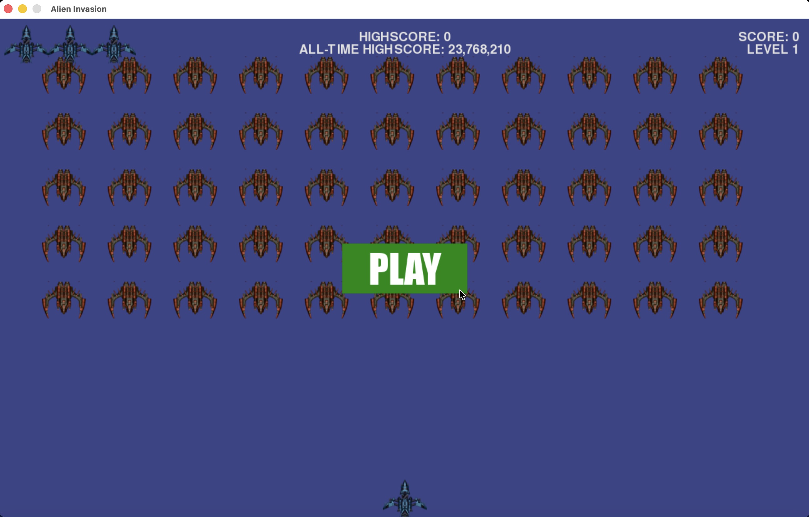

# Alien Invasion

> By _[Morpheus](https://www.github.com/TheGittyPerson)_

### Description:
This is a simple Python Alien Invasion shooting game built using the 
`pygame` library.

This project is based on a tutorial in 
[Eric Matthes's 2023 book](https://www.google.com/search?q=python+crash+course+by+eric+matthes), 
_Python Crash Course (Third Edition)_.

### How to Play:
1. Run `main.py` in a Python environment.
2. On first run, the program will first automatically install `pygame` using 
   pip (if not already installed).
3. A new game window will appear on your screen. Press "PLAY" to start.
4. Use **arrow keys to move**, **space bar to shoot**.
5. Your goal is to prevent the advancing aliens from reaching your ship (or 
   near the bottom of the screen). The alien ships move a step downwards 
   everytime they hit the side edge of the screen.
6. You have four lives, as indicated in the top left corner of the screen,
7. You can see your highscore (and all-time highscore) at the top of the 
   screen. Your all-time highscore is saved on your device in a TXT file.
8. To quit, simply close the game window or press Q.
9. Have fun!
